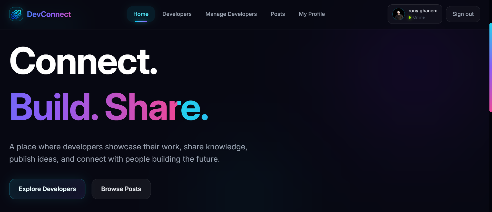
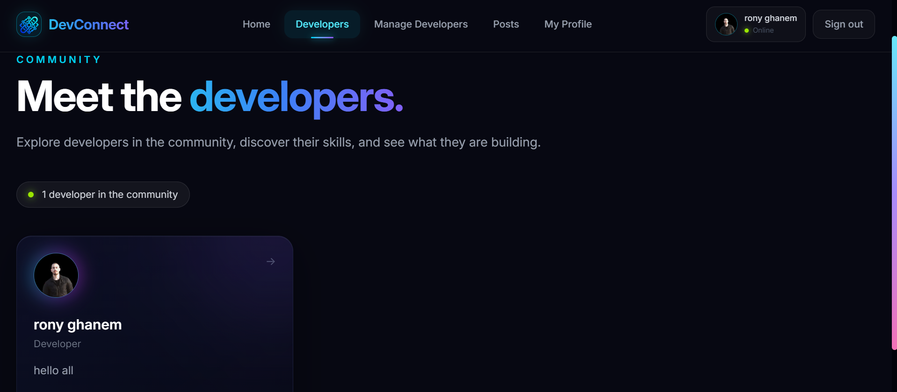
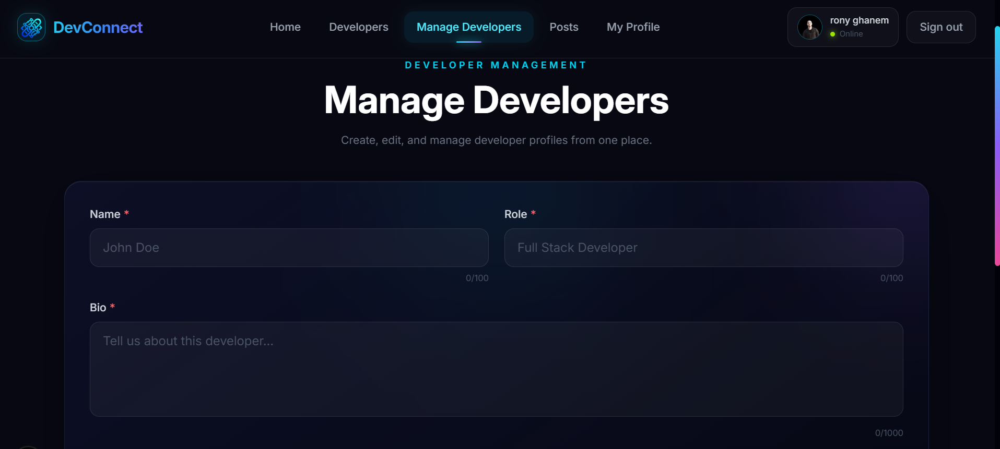
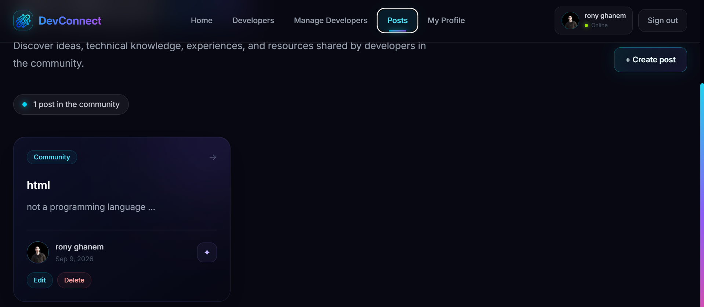
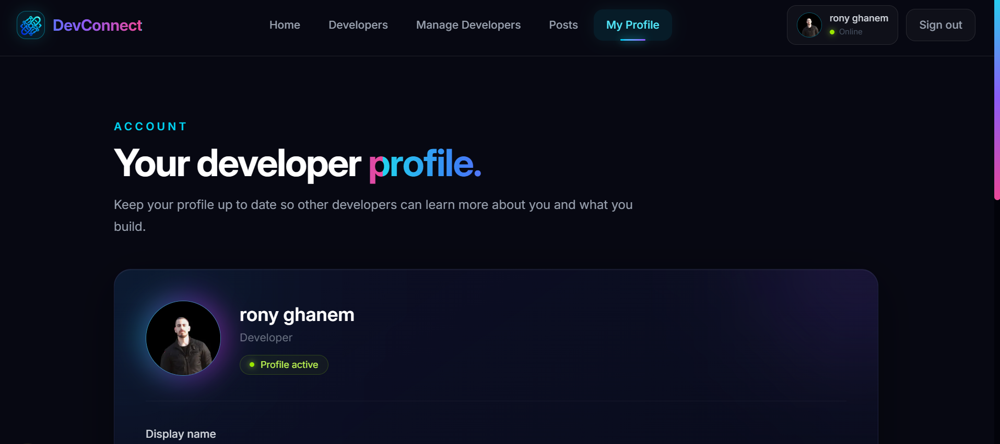

# DevConnect

**DevConnect** is a full-stack developer community platform built with **Next.js 16, TypeScript, MongoDB, Mongoose, and Auth.js**.

The platform provides a centralized space where developers can create profiles, showcase their technical skills, publish posts, and discover other developers. It also includes an administrative dashboard for managing developer profiles through secure CRUD operations.

## 🌐 Live Application

**Live Demo:** https://devz-connect.vercel.app/

**Repository:** https://github.com/ronyghanem/dev-connect

---

## Overview

DevConnect was developed as a full-stack application to demonstrate modern web development practices using the Next.js App Router.

The application combines authentication, database management, REST API development, server-side validation, authorization, and a responsive user interface into a single developer-focused platform.

The project features a futuristic dark interface with glassmorphism elements, neon accents, responsive layouts, and interactive components.

---

## Features

### Developer Profiles

* Browse developer profiles
* Display developer roles and biographies
* Showcase technical skills
* Display profile images
* Integrate GitHub developer information

### Authentication

* GitHub OAuth authentication
* Auth.js session management
* Protected administrative operations
* Role-based access through administrator authorization

### Community Posts

* Create posts
* View published posts
* Edit posts
* Delete posts
* Manage post ownership and permissions

### Developer Management

Administrators can manage developer profiles through a dedicated CRUD interface.

Available operations include:

* Create developer profiles
* Edit existing profiles
* Update name, role, biography, and profile image
* Delete developer profiles
* Confirmation before permanent deletion
* Real-time interface updates after changes

### Input Validation

The application implements client-side and server-side validation.

Validation includes:

* Required fields
* Data type validation
* Whitespace validation
* Minimum and maximum field lengths
* MongoDB ObjectId validation
* Invalid JSON handling
* Missing resource handling
* Clear API error responses

### Responsive Interface

The interface is designed to work across:

* Desktop
* Tablet
* Mobile

The UI uses a futuristic visual system based on dark backgrounds, glass-style cards, neon accents, animations, and responsive layouts.

---

## Technology Stack

| Technology   | Usage                            |
| ------------ | -------------------------------- |
| Next.js 16   | Full-stack application framework |
| React 19     | UI development                   |
| TypeScript   | Type-safe development            |
| Tailwind CSS | Styling and responsive design    |
| MongoDB      | Database                         |
| Mongoose     | Database modeling and queries    |
| Auth.js      | Authentication                   |
| GitHub OAuth | Authentication provider          |
| Vercel       | Deployment                       |

---

## Architecture

DevConnect follows a full-stack Next.js architecture.

```text
┌───────────────────────────────────────────┐
│                  Client UI                │
│       React + Next.js + Tailwind CSS      │
└─────────────────────┬─────────────────────┘
                      │
                      ▼
┌───────────────────────────────────────────┐
│              Next.js App Router           │
│        Server & Client Components         │
└─────────────────────┬─────────────────────┘
                      │
                      ▼
┌───────────────────────────────────────────┐
│                REST API                   │
│       Developers / Posts / Auth           │
└─────────────────────┬─────────────────────┘
                      │
                      ▼
┌───────────────────────────────────────────┐
│             Mongoose / MongoDB            │
│        Users / Developers / Posts         │
└───────────────────────────────────────────┘
```

---

## Project Structure

```text
dev-connect/
│
├── app/
│   ├── (main)/
│   │   ├── developers/
│   │   ├── developers-crud/
│   │   ├── posts/
│   │   └── ...
│   │
│   ├── api/
│   │   ├── developers/
│   │   ├── posts/
│   │   └── ...
│   │
│   └── ...
│
├── components/
│   ├── Navbar
│   ├── UI components
│   └── ...
│
├── lib/
│   ├── mongodb.ts
│   └── isAdmin.ts
│
├── models/
│   ├── User.ts
│   ├── Developer.ts
│   └── Post.ts
│
├── public/
│
├── auth.ts
├── package.json
├── tsconfig.json
└── README.md
```

---

## API

### Developer API

#### Retrieve developers

```http
GET /api/developers
```

Returns the available developer profiles.

#### Create a developer

```http
POST /api/developers
```

Creates a new developer profile.

#### Update a developer

```http
PUT /api/developers/:id
```

Updates an existing developer profile.

#### Delete a developer

```http
DELETE /api/developers/:id
```

Permanently removes a developer profile.

Administrative endpoints are protected by authentication and administrator authorization.

---

## Validation

Developer data is validated before being stored in the database.

### Name

* Required
* String
* Minimum 2 characters
* Maximum 100 characters
* Whitespace-only values rejected

### Role

* Required
* String
* Maximum 100 characters
* Whitespace-only values rejected

### Biography

* Required
* String
* Maximum 1000 characters
* Whitespace-only values rejected

### Profile Image

* Optional
* String
* Maximum 500 characters

### MongoDB IDs

MongoDB ObjectIds are validated before update and delete operations.

Invalid requests return appropriate HTTP status codes and descriptive error messages.

---

## Authentication & Authorization

GitHub OAuth is implemented through Auth.js.

Authenticated users can access protected functionality according to their permissions.

Administrative operations are restricted through an administrator email configured through an environment variable.

```text
ADMIN_EMAIL
```

This protects developer creation, editing, and deletion operations from unauthorized users.

---

## Developer Management Interface

The administrative developer management interface provides a dedicated editing workflow.

Administrators can select a developer and modify:

* Name
* Role
* Biography
* Profile image

The interface provides:

* Form validation
* Character limits
* Loading states
* Success messages
* Error messages
* Edit mode indicators
* Cancel functionality
* Delete confirmation modal
* Responsive layout

The application uses relative API routes rather than hardcoded development URLs, allowing the same API structure to work in both local development and production deployments.

---

## Environment Variables

The application requires the following environment variables:

```env
MONGODB_URI=your_mongodb_connection_string

AUTH_SECRET=your_auth_secret

GITHUB_ID=your_github_client_id

GITHUB_SECRET=your_github_client_secret

ADMIN_EMAIL=your_admin_email
```

Environment variables are intentionally excluded from version control.

---

## Local Development

### Installation

```bash
git clone https://github.com/ronyghanem/dev-connect.git
```

```bash
cd dev-connect
```

```bash
npm install
```

### Environment Configuration

Create a `.env.local` file in the project root and configure the required environment variables.

### Start Development Server

```bash
npm run dev
```

The application will be available at:

```text
http://localhost:3000
```

---

## Production Build

The project can be verified using the production build process:

```bash
npm run build
```

The production server can then be started with:

```bash
npm start
```

---

## Deployment

DevConnect is deployed on **Vercel**.

Production application:

**https://devz-connect.vercel.app/**

The production deployment uses the same application architecture and API routes as the local development environment.

Required environment variables are configured through the deployment environment rather than being stored in the repository.

---

## Screenshots

### Home



### Developers



### Developer Management



### Community Posts



### my profile



---

## Key Development Concepts

DevConnect demonstrates practical implementation of:

* Next.js App Router
* React Server Components
* React Client Components
* TypeScript
* REST API development
* CRUD operations
* MongoDB integration
* Mongoose schemas and queries
* Authentication
* Authorization
* GitHub OAuth
* Server-side validation
* Client-side validation
* Protected API routes
* Responsive UI development
* Error handling
* Production deployment

---

## Project Objectives

The project was developed to provide practical experience building a complete full-stack application from frontend interface to backend API and database integration.

The main objectives were to:

* Build a modern full-stack application with Next.js
* Implement database-backed CRUD functionality
* Integrate authentication and authorization
* Develop protected API routes
* Implement robust input validation
* Create a responsive and polished user interface
* Deploy the application to a production environment

---

## Author

### Rony Ghanem

Management Information Systems graduate focused on web development, AI technologies, backend development, and modern software engineering.

**GitHub:** https://github.com/ronyghanem

**LinkedIn:** https://linkedin.com/in/rony-ghanem

**Portfolio:** https://ronygh.netlify.app/

---

## License

This project was developed as a learning and portfolio project.
